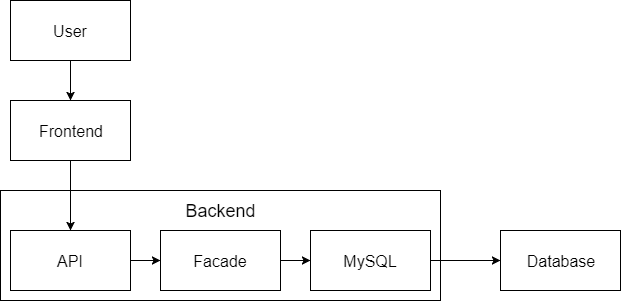

# LSD Exam report

## 1. Requirements, architecture, design and process

### 1.1. System requirements

### 1.2. Development process  

Igennem hele projektet har vi anvendt en agil tilgangsvinkel, men ikke nogen specifik udviklingsmetode.  
Det vil sige at vi har fokuseret mest på at få nye krav og features implementeret som de kom, ved brug af kommunikation imellem teamets medlemmer.  
  
Under udviklingen af den første version af projektet anvendte vi Trello, til at strukturere implementeringen af de forskellige features og requirements. Det blev dog ikke anvendt religiøst, hvilket i kombination med vores agile tilgang, blev lidt kaotisk til tider.
  
Trello er et website, hvor man kan oprette virtuelle scrum boards, som kan gøre det lettere for teams at organisere hvem, der laver hvad og hvilke features der mangler at blive implementeret. 
Som alle nok er klar over, kræver det sådan et værktøj at alle fra teamet opdaterer boardet så snart der er nogle opdateringer. Hvis det ikke bliver opdateret, resulterer det i at det overblik som scrum boardet skulle give teamet, rent faktisk ikke repræsenterer virkeligheden.
  
Trello blev efterfølgende erstattet af ugentlige sprints, der indeholdte de forskellige nye krav, der skulle implementeres, og blev hovedsageligt kommunikeret via chatbeskeder. 

### 1.3. Software architecture

Vores system er bygget op af to subsystems:

- Frontend hovedsageligt lavet i AngularJS
- Backend lavet i Java

Derudover har vi også en MySQL database til at lagre vores data. Dermed ser vores dataflow sådan ud:

Subsystem Sekvensdiagram:

#### Frontend

Da vores frontend er lavet i AngularJS fungerer siden som en single-page-application, hvor vi har delt de forskellige undersider op, så de har hver deres view bestående af en .html-fil og en .js-fil. Derudover er der lavet forskellige komponenter som controllerne i .js-filerne har adgang til. komponenterne tæller bl.a. authentication, factory, filter og service.

Alle controllerne benytter sig af vores factory, som er ansvarlig for alt kommunikation med vores backend igennem funktionerne: getStories() og addPost(post). Vores frontend modtager stories når hjemmesiden indlæses, herefter bliver dataen skrevet til browserens localstorage, hvis dette er muligt. I det tilfælde at forbindelsen til vores backend skulle blive brudt, vil brugeren nu være i stand til at bruge en cached version indtil forbindelsen genoprettes. Brugeren vil se en besked under menuen, som beskriver hvorledes det har været muligt at connecte med serveren og/eller det har været muligt at indlæse data fra localstorage, såfremt det er nødvendigt. 

#### Backend

Vores backend er bygget efter BCE-modellen og består af nogle entity-klasser til comment, story og user der benyttes af vores StoryController, som håndterer kommunikationen ned til databasen igennem persistence-laget med PreparedStatements, og op til facaden i boundary-laget, som indeholder vores REST-API der har denne struktur:

- Show latest stories -
GET: /api/stories

- Select story -
GET: /api/stories/view/{id}

- Show comments -
GET: /api/stories/{id}/comments
- Submit story -
POST(Story): /api/stories
- Upvote story -
POST: /api/stories/{id}/upvote
- Downvote story -
POST: /api/stories/{id}/downvote
- Comment on story -
POST(StoryComment): /api/stories/{id}/comment
- Login - 
POST(LoginCredentials): /api/auth/login
- Register -
POST(RegisterCredentials): /api/auth/register

Derudover har vi både i boundary- og control-lagene klasser til at håndtere metrics i forbindelse med prometheus.

#### Database

Logisk data model for vores MySQL database:

### 1.4. Software design

#### Frontend
Vi blev ret hurtigt enige om at benytte AngularJS til vores frontend, da vi havde mulighed for at udnytte flere funktionaliteter fra frameworket, som ville spare os for meget tid. Bl.a. databinding og specielt ng-repeat funktionen ville vi kunne udnytte, ved at style og programmere én story eller én comment og derefter påføre den kode og styling til alle elementerne ved at iterere over dem. Samtidig er AngularJS god til at håndtere profiler på en hjemmeside, specielt i forhold til elementer der bør skjules i forhold til om man er logget ind eller ud.

Når vi bruger AngularJS til at kode vores frontend, så laver vi samtidig en SinglePageApplication, hvilket vi ser, som en fordel for brugerne af hjemmesiden, da man kan navigere rundt på hjemmesidens forskellige undersider, uden at skulle indlæse hele siden hver gang.

Vi ønskede at det var muligt for en bruger, at navigere på en cached version af hjemmesiden, hvis brugeren havde besøgt den før, og dermed gemt data om stories og comments i browserens LocalStorage. Derfor udføres der altid et tjek når der hentes eller sendes data med koden:

- `localStorageService.isSupported`

For at sikre at vi kan benytte localStorage hos brugeren, før vi skriver dertil eller læser derfra.  Herefter vil brugerens ændring blive gemt i localStorage ved hjælp af et key/value par, og samtidig sendes ændringen til vores backend igennem vores factory.

Denne funktionalitet betyder at alle brugere der har indlæst hjemmesiden én gang, vil kunne benytte den, selvom vores backend-server skulle gå ned for en stund. 

#### Backend
I forhold til vores backend, aftalte vi i gruppen at vi ønskede at gøre brug af Java som programmeringssprog. Valget faldt på Java, på grund af vi alle sammen i forvejen havde et stort kendskab til sproget, samt vi at tidligere har erfaret at Java har god performance til denne type opgave. Derudover ville vi relativt hurtigt kunne have et REST API kørende, og det samme var gældende for vores database-forbindelse med JDBC. Som tidligere nævnt faldt vores valg af database på MySQL.

**Pattern**

> Kilde: http://training-course-material.com/training/UML_Communication_Diagram

Boundary Control Entity, er en variant af MVC modellen. Vi valgte at bruge dette pattern for at uddele ansvaret af opgaver til passende klasser, og for at gøre det nemmere at teste vores klasser og logikken i selve koden.

**Boundary:**
Boundary-laget er grænsen mellem brugergrænseflade og vores ”forretningslogik”. Denne har til formål at isolere API’et fra den resterende del af systemet. Vi valgte at bruge JAX-RS som er Javas API, til RESTful Web Services. 

Udover klasserne til vores REST API, besluttede vi også at have en facade klasse, som skulle fungere som den eneste adgang fra Controller klasserne til vores database.   

**Controller:**
Controller-laget fungerer som et sted til opbevaring af ”hjælper” klasser. Vi valgte at have en stor del af vores logik i dette lag, da det skulle sikre at det blev nemmere at teste koden, sammenlignet med hvis vi havde det hele i Boundary klasserne.   

**Entity:**
Entity-laget ville vi bruge til at opbevare entitets klasser, som skulle bruges til persistering til vores database.
 

#### Database
Vi valgte at bruger en MySQL database til data persistering. Vores valg faldt på en relationel database, da vi mente at den ville havde en bedre performance til denne størrelse af systemer, end f.eks. Neo4J. Dette havde vi undersøgt tidligere i vores database fag på 1. semester og kunne med fordel bruge den erfaring vi havde fået derfra. 

Vi brugte JDBC (Java Database Connectivity), til at tilgå databasen. Vi valgte at vi ville bruge Java’s Prepared Statements interface til at forespørge i data, samt til opdatering af vores data. Dette valgte vi fordi at Prepared Statement” har en bedre performance end f.eks. ordinære statements, dette skyldes at de kun bliver kompileret én gang, nemlig første gang. Derudover giver det også en bedre sikkerhed, da det sikre at muligheden for ”SQL-injection” elimineres.    

### 1.5. Software implementation

## 2. Maintenance and SLA status

### 2.1. Hand-over ###
Den 6. november modtog vi et link til en pdf på den gruppe vi skulle agerere operator for. Pdf’en indeholder det mest nødvendige information omkring systemet. I starten står der hvilken ip adresse systemet befinder sig på, efterfølgende får vi lidt flere informationer omkring hvordan det hele er sat op i forhold til servere og virtuelle maskiner.
Der står også vi kan få adgang ind på serveren hvis vi ønsker, og vi bare skal kontakte dem så skal de nok give os en forbindelse. der er også lavet et diagram der viser dataflowet i systemet. Der er også linket til et andet dokument der udførligt beskriver backenden, i forhold til hvilke kald der er mulige at udføre, hvilke routes man skal bruge, om det er GET, PUT eller POST, hvad der forventes at blive sendt med i requested og hvad man kan forvente at få tilbage, både ved et succesfuld request og et med fejl. Det eneste man kunne sætte en finger på, er at der ikke er skrevet at man skal kalde på port 8080, men det gættede vi os hurtigt frem til, da de havde skrevet at backenden var skrevet i Java.
Til sidst er der nævnt hvordan vi skal indrapportere bugs i deres system.

Så overordnet set har vi været yderst tilfredse med den dokumentation der er blevet sendt til os, den har været godt gennemarbejdet, og det virker velovervejet det der er skrevet.
  
### 2.2. Service-level agreement ###

I forbindelse med gruppe f er vi blevet enige om en SLA som inderholder følgende punkter:

* En oppetid på 99%. 
* Response time skal maks være på 10 sekunder. 
Disse punkter har fået et lille afsnit hver nedenfor hvor der vil blive nærmere uddybet hvordan disse krav skal fortolkes.
#### Oppetid ####
Vi er blevet enige med gruppe f om at deres system skal have en oppetid på 99% eller højere. Oppetiden skal beregnes ved at sende request til serveren til API’ets status funktion, som er lavet til at tjekke om serveren er i live. Ud fra det samlet antal af kald og antallet af succes kald, måles serverens oppetid.

Dog vil gruppen ikke blive holdt ansvarlige for en faldende oppetid i tilfælde af begivenheder der er ude af deres kontrol, dette inkludere bl.a. at deres hosting firma bliver angrebet af hackere eller udsat for strømsvigt.

#### Responstid #### 
Vi har aftalt at systemet ikke må være mere end 10 sekunder om at svare, denne tid er fra serveren modtager et request til den sender et response retur, dette vil betyde at gruppen ikke vil blive holdt ansvarlig for en eventuel ekstraordinær dårlig internetforbindelse fra slutbrugerens side af.
Tiden vil blive målt som den gennemsnitlige request tid, for det samlede antal request der sendes afsted til serveren. 

### 2.3. Maintenance and reliability

## 3. Discussion

## 3.1. Technical discussion

## 3.2. Group work reflection & Lessons learned
