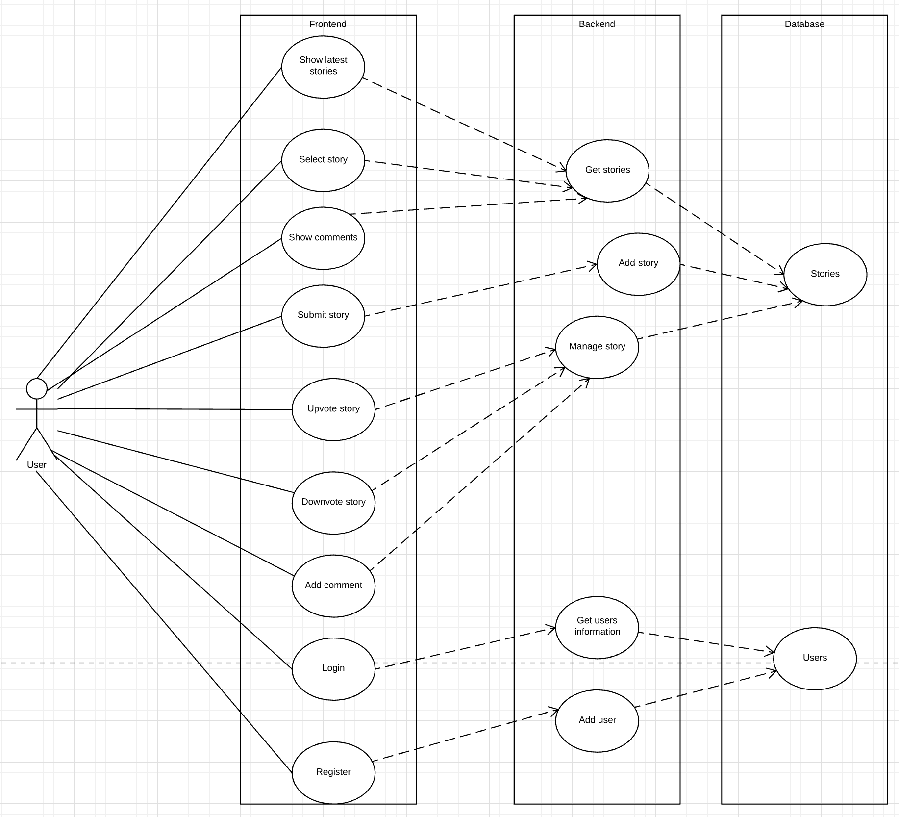
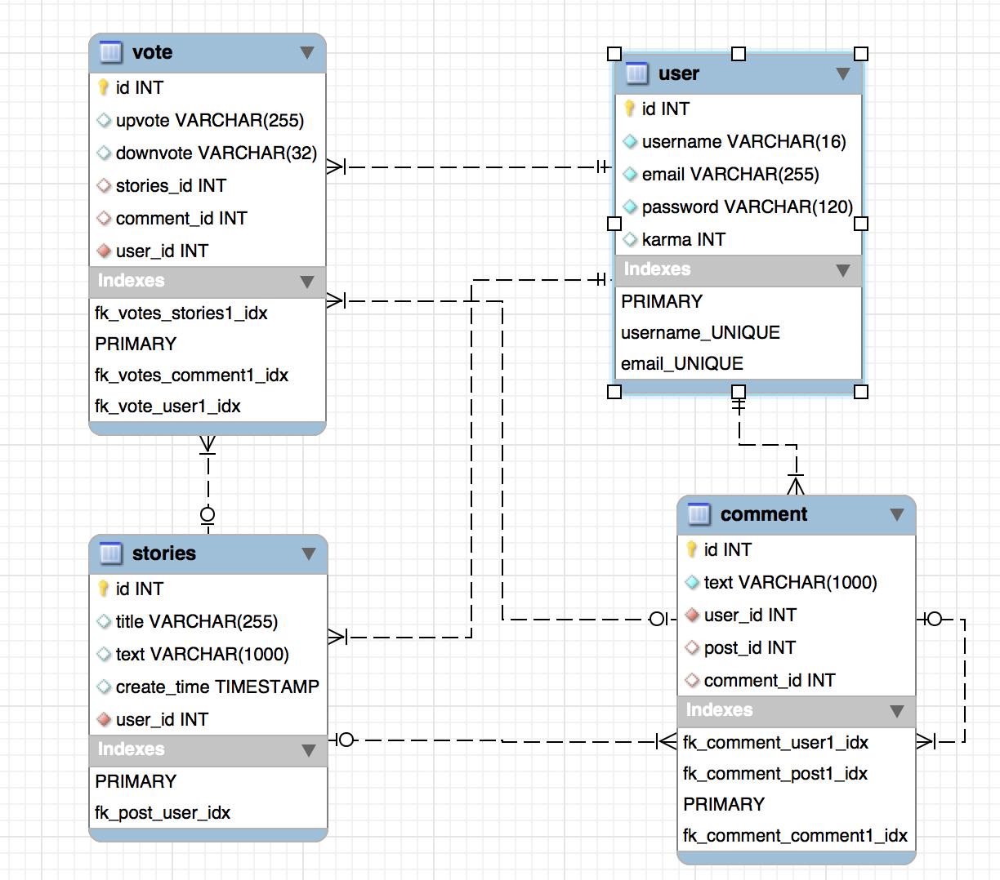
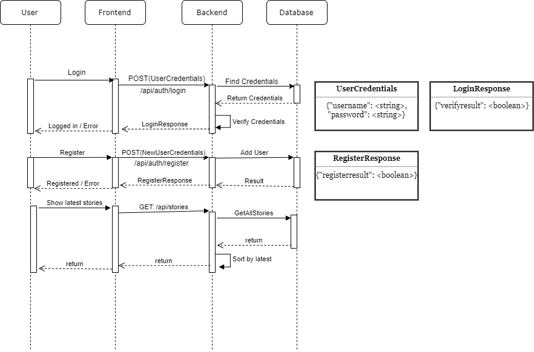

# hacker_news

## Team
### Alle i teamet vil bidrage med 20% hver.
### Andreas Heindorff Larsen: Q&A
### Kasper Hornum Pontoppidan: Architect

## Introduction
- Purpose of the System
	- Formålet er at bygge en hjemmeside, hvor registrerede brugere kan lave indlæg, der både kan ses, kommenteres og vurderes af andre brugere. De enkelte kommentarer på indlæg kan også vurderes af andre brugere. Dette vil resulterer i et miljø, hvor brugere kan dele deres oplevelser eller interessante nyheder med andre brugere, hvilket kan lede til mange forskellige slags interaktioner imellem hjemmesidens brugere.
	- Systemet kan sammenlignes med HackerNews og Reddit (se References).
- Scope of the System
	- Folk med en interesse for teknologi. Kan være baggrund, arbejde, skole eller interesser.
	- Mandlige brugere af en alder mellem 20 og 30 år.
	- Forum for diskussioner, samtaler og deling af information.
	- Begrænset bruger base.

- Objectives and success criteria of the project
	- Objecives:
		- At anvende en Agile udviklingsmetode. Dette vil effektiviserer udviklingen af systemet.
	- Success criteria:
		- Systemet vil have en meget høj oppetid, og at der ikke går noget data tabt.
		- Alt data bliver gemt i en database.
		- En hjemmeside hvor alle indlæg kan ses, kommenteres og reageres på.
		- Brugere kan:
			- Registrere sig i systemet med både Username og Password.
			- Både logge ind og ud af systemet.
			- Lave indlæg.
			- Kommenterer på indlæg og andre brugeres kommentarer.
			- Reagerer på andre brugeres indlæg og kommentarer, ved enten at Up eller Down vote.
			- Modtage Karma point, baseret på hvor mange Up og Down votes de får.

	- Definitions, acronyms and abbreviations
		- Karma point: Karma point er summen af alle Up votes en brugers indlæg eller kommentarer har fået, minus summen alle Down votes brugerens indlæg eller kommentarer har fået.
		- Indlæg: Et indlæg kan bestå af billeder, tekst, links, gifs, videoer mm.
	- References
		- Reddit: https://www.reddit.com/
		- HackerNews: https://news.ycombinator.com/
		- Både Reddit og HackerNews er sociale nyhedshjemmesider, hvor brugere kan lave indlæg, der kan kommenteres og reageres
		på af andre registerede brugere.
	- Overview
		- Systemet vil altså være en kilde for folk med en interesse for tekonoligi, som de dagligt kan søge til for enten at dele eller indtage viden, eller deltage i samtaler og diskussioner. Brugerne vil kunne Up eller Down vote indlæg eller kommentarer, som de føler fortjæner det.

## Current system
Der er som udgangspunkt intet nuværende eksistrende system. Det kommende system skal dog efterligne det eksisterende site "Hacker News".

## Proposed system

### Overview

Systemet skal som udgangspunkt fungere som et socialt nyhedswebsite, med fokus på computervidenskab og iværksætteri. Målet med udviklingen af systemet, er at have et website med en funktionalitet der minder om Reddit og mere specifikt være en efterligning af "Hacker News" (https://news.ycombinator.com/).

Systemet skal kunne håndtere at brugere kan registrere sig på siden og tilføje nyheder og historier, og kommentere på eksisterende indhold. Derudover skal brugere af websitet kunne up- og down-vote på historier eller kommentarer, alt efter om brugeren mener at indholdet bidrager med noget positivt eller negativt.     

### Functional requirements

#### User Stories

| **Id** | **User Story** | **Id** | **User Story** |
| --- | --- | --- | --- |
|   | **Before login** |   |   |
| **1** | A user must be able to read stories in a sorted order | **2** | A user must be able to register a new account |
| **3** | A user must be able to retrieve a new password for his/her account. | **4** | A user must be able to log in to his/her account |
| **5** | A user must be able to view all comments submitted to a story | **6** | A user must be able to see time-since-submit of stories |
| **7** | A user must be able to see the amount of comments made to a story | **8** | A user must be able to see the amount of karma accumulated by a story |
| **9** | A user must be able to hide comment-trees | **10** | A user must be able to un-hide comment-trees  |
|   | **After successful login** |   |   |
| **11** | A user must be able to submit new stories (title/url/text) | **12** | A user must be able to edit his/her submitted stories. |
| **13** | A user must be able to view a list of his/her submitted stories | **14** | A user must be able to delete his/her stories |
| **15** | A user must be able to submit a comment to a story (text/gif/link/img) | **16** | A user must be able to submit a comment (text/gif/link/img) to a comment |
| **17** | A user must be able to view a list of his/her submitted comments | **18** | A user must be able to delete his/her comments |
| **19** | A user must be able to edit his/her submitted comments | **20** | A user must be able to edit his/her profile |
| **21** | A user must be able to delete his/her profile | **22** | A user must be able to edit the email assigned to his/her profile |
| **23** | A user must be able to mark stories as  favorites | **24** | A user must be able to mark comments as favorites |
| **25** | A user must be able to view a list of all  his/her favorite entities | **26** | A user must be able to remove entities from his/her list of favorites |
| **27** | A user must be able to switch between sub-pages of different categories. | **28** | A user must be able to flag stories as spam |
| **29** | A user must be able to flag comments as spam | **30** | A user must be able to upvote stories |
| **31** | A user must be able to downvote stories when they have 500+ karma | **32** | Users must be able to downvote comments when they have 500+ karma |
| **33** | A user must be able to upvote comments | **34** |   |
| **35a** | A user must be able to view his/her amount of karma points | **35b** | Karma points must be calculated by (upvotes - downvotes) |
| **36** | A User must be able to log out |   |   |

### Nonfunctional requirements
  - Usability
     - Systemet skal have et REST API som gør det muligt for et simulator program at publicere og kommentere.
     - REST API’et skal også kunne fortælle hvilken stadie systemet er i, fx om det er kørende eller ved at opdatere.
     - API’et skal også kunne fortælle hvem der sidst har skrevet et indlæg eller en kommentar.
  - Reliability
    - Systemet skal have en oppetid på mere end 95%.
    - Systemet må ikke miste noget af det data som bliver modtaget fra simulator programmet.
    - Der skal være en buffering mekanisme som kan gemme indkommende indhold imens systemet er nede og publicere det når systemet kommer online igen.
  - Performance
  - Supportability
  - Implementation
    - Systemet skal deles op i en frontend og en backend.
    - Frontenden skal vise artiklerne og kommentarerne.
    - frontenden skal også kunne tage imod nye indlæg.
    - backenden skal modtage dataen fra frontenden og sørger for at gemme den.
    - backenden skal også give frontenden alt den data som frontenden har brug for.
    - alt data skal gemmes i en database.
    - frontenden vil blive lavet i angular
    - Backenden vil blive lavet i Java
    - databasen vil blive lavet i mySql
  - Interface
  - Packaging
  - Legal

### System models

#### Use Case Diagram

<table>
  <tr>
    <td>Name:</td>
    <td>Select story</td>
  </tr>
  <tr>
    <td>Actor: </td>
    <td>User</td>
  </tr>
  <tr>
    <td>Entry Conditions:</td>
    <td>User is on the front page</td>
  </tr>
  <tr>
    <td>Flow of Events:</td>
    <td>User clicks on a story title
Site opens new tab with link to the corresponding story</td>
  </tr>
  <tr>
    <td>Exit conditions:</td>
    <td>The user has a new tab open with the selected story</td>
  </tr>
</table>

<table>
  <tr>
    <td>Name:</td>
    <td>Show latest stories</td>
  </tr>
  <tr>
    <td>Actor: </td>
    <td>User</td>
  </tr>
  <tr>
    <td>Entry Conditions:</td>
    <td>User is on any page</td>
  </tr>
  <tr>
    <td>Flow of Events:</td>
    <td>User clicks on "new"
Site directs user to new list</td>
  </tr>
  <tr>
    <td>Exit conditions:</td>
    <td>The user is shown the latest stories</td>
  </tr>
</table>

<table>
  <tr>
    <td>Name:</td>
    <td>Hide story</td>
  </tr>
  <tr>
    <td>Actor: </td>
    <td>User</td>
  </tr>
  <tr>
    <td>Entry Conditions:</td>
    <td>User is on the front page</td>
  </tr>
  <tr>
    <td>Flow of Events:</td>
    <td>User clicks "hide" on the story</td>
  </tr>
  <tr>
    <td>Exit conditions:</td>
    <td>The story is hidden from the user</td>
  </tr>
</table>

<table>
  <tr>
    <td>Name:</td>
    <td>Submit story</td>
  </tr>
  <tr>
    <td>Actor: </td>
    <td>User</td>
  </tr>
  <tr>
    <td>Entry Conditions:</td>
    <td>User is on any page and is logged in</td>
  </tr>
  <tr>
    <td>Flow of Events:</td>
    <td>User clicks on "submit"
Site presents the user with the submission screen
User enters submission data and clicks on “submit”</td>
  </tr>
  <tr>
    <td>Exit conditions:</td>
    <td>The user is returned to the front page and the submission has been added to the list of stories</td>
  </tr>
</table>

<table>
  <tr>
    <td>Name:</td>
    <td>Login</td>
  </tr>
  <tr>
    <td>Actor: </td>
    <td>User</td>
  </tr>
  <tr>
    <td>Entry Conditions:</td>
    <td>User is on any page</td>
  </tr>
  <tr>
    <td>Flow of Events:
</td>
    <td>User clicks on "login"
Site directs user to the login screen
User enters username and password in the “Login” fields
User clicks on “login”</td>
  </tr>
  <tr>
    <td>Exit conditions:</td>
    <td>The user is returned to the front page and has been logged in</td>
  </tr>
</table>

<table>
  <tr>
    <td>Name:</td>
    <td>Logout</td>
  </tr>
  <tr>
    <td>Actor: </td>
    <td>User</td>
  </tr>
  <tr>
    <td>Entry Conditions:</td>
    <td>User is on any page</td>
  </tr>
  <tr>
    <td>Flow of Events:
</td>
    <td>User clicks on "logout"</td>
  </tr>
  <tr>
    <td>Exit conditions:</td>
    <td>The user is returned to the front page and has been logged out</td>
  </tr>
</table>

<table>
  <tr>
    <td>Name:</td>
    <td>Register</td>
  </tr>
  <tr>
    <td>Actor: </td>
    <td>User</td>
  </tr>
  <tr>
    <td>Entry Conditions:</td>
    <td>User is on any page</td>
  </tr>
  <tr>
    <td>Flow of Events:
</td>
    <td>User clicks on "login"
Site directs user to the login screen
User enters username and password in the “Create Account” fields
User clicks on “create account”</td>
  </tr>
  <tr>
    <td>Exit conditions:</td>
    <td>The user is returned to the front page and has been logged in</td>
  </tr>
</table>

<table>
  <tr>
    <td>Name:</td>
    <td>Retrieve password</td>
  </tr>
  <tr>
    <td>Actor: </td>
    <td>User</td>
  </tr>
  <tr>
    <td>Entry Conditions:</td>
    <td>User is on loginpage and not logged in</td>
  </tr>
  <tr>
    <td>Flow of Events:
</td>
    <td>User clicks on "Request new password". 
	User enters Email. 
	User recieves email with temporary password and can now log in</td>
  </tr>
   <tr>
    <td>Alternate flow of events:</td>
    <td>User clicks on "Request new password". 
	User enters Email. Email is not registered and user is notified.</td>
  </tr> 
  <tr>
    <td>Exit conditions:</td>
    <td>A message is shown, notifying the user that the password has been reset</td>
  </tr>
</table>

<table>
  <tr>
    <td>Name:</td>
    <td>Upvote story</td>
  </tr>
  <tr>
    <td>Actor: </td>
    <td>User</td>
  </tr>
  <tr>
    <td>Entry Conditions:</td>
    <td>User is on the front page and is logged in</td>
  </tr>
  <tr>
    <td>Flow of Events:
</td>
    <td>User clicks on up-arrow next to a story</td>
  </tr>
  <tr>
    <td>Exit conditions:</td>
    <td>The story has received a point and now gives the user an option to "unvote"
The user is awarded 1 karma point</td>
  </tr>
</table>

<table>
  <tr>
    <td>Name:</td>
    <td>Downvote story</td>
  </tr>
  <tr>
    <td>Actor: </td>
    <td>User</td>
  </tr>
  <tr>
    <td>Entry Conditions:</td>
    <td>User is on the front page and is logged in and has more than 500 karma points</td>
  </tr>
  <tr>
    <td>Flow of Events:
</td>
    <td>User clicks on down-arrow next to a story</td>
  </tr>
  <tr>
    <td>Exit conditions:</td>
    <td>The story has lost a point
The user has lost a karma point</td>
  </tr>
</table>

<table>
  <tr>
    <td>Name:</td>
    <td>Downvote comment</td>
  </tr>
  <tr>
    <td>Actor: </td>
    <td>User</td>
  </tr>
  <tr>
    <td>Entry Conditions:</td>
    <td>User is on a comment page and is logged in and has more than 500 karma points</td>
  </tr>
  <tr>
    <td>Flow of Events:
</td>
    <td>User clicks on down-arrow next to a comment</td>
  </tr>
  <tr>
    <td>Exit conditions:</td>
    <td>The comment has lost a point
The user has lost a karma point</td>
  </tr>
</table>

<table>
  <tr>
    <td>Name:</td>
    <td>Upvote comment</td>
  </tr>
  <tr>
    <td>Actor: </td>
    <td>User</td>
  </tr>
  <tr>
    <td>Entry Conditions:</td>
    <td>User is on a comment page and is logged in</td>
  </tr>
  <tr>
    <td>Flow of Events:
</td>
    <td>User clicks on up-arrow next to a comment</td>
  </tr>
  <tr>
    <td>Alternate flow of events:</td>
    <td>Users clicks on up-arrow and is not logged in
Site directs user to login screen
User enters login information and clicks "login"</td>
  </tr>
  <tr>
    <td>Exit conditions:</td>
    <td>The comment has received a point and now gives the user an option to “unvote”
The user is awarded 1 karma point</td>
  </tr>
</table>

<table>
  <tr>
    <td>Name:</td>
    <td>Show comments</td>
  </tr>
  <tr>
    <td>Actor: </td>
    <td>User</td>
  </tr>
  <tr>
    <td>Entry Conditions:</td>
    <td>User is on the front page</td>
  </tr>
  <tr>
    <td>Flow of Events:
</td>
    <td>User clicks "comments" for a story
Site directs the user to the comments
</td>
  </tr>
  <tr>
    <td>Exit conditions:</td>
    <td>The user is shown comments on the story</td>
  </tr>
</table>

<table>
  <tr>
    <td>Name:</td>
    <td>Comment on story</td>
  </tr>
  <tr>
    <td>Actor: </td>
    <td>User</td>
  </tr>
  <tr>
    <td>Entry Conditions:</td>
    <td>User is on the front page and is logged in</td>
  </tr>
  <tr>
    <td>Flow of Events:
</td>
    <td>User clicks "comments" for a story
Site directs the user to the comments
User enters text in the comment field
User clicks “add comment”</td>
  </tr>
  <tr>
    <td>Alternate flow of events:</td>
    <td>Users clicks “add comment” and is not logged in
Site directs user to login screen
User enters login information and clicks “login”</td>
  </tr>
  <tr>
    <td>Exit conditions:</td>
    <td>The comment is added to the corresponding story </td>
  </tr>
</table>

<table>
  <tr>
    <td>Name:</td>
    <td>Reply to comment</td>
  </tr>
  <tr>
    <td>Actor: </td>
    <td>User</td>
  </tr>
  <tr>
    <td>Entry Conditions:</td>
    <td>User is on a comment page and is logged in</td>
  </tr>
  <tr>
    <td>Flow of Events:
</td>
    <td>User clicks on "reply" on a comment
User enters text in the comment field
User clicks “reply”</td>
  </tr>
  <tr>
    <td>Exit conditions:</td>
    <td>The comment is added to the comment tree</td>
  </tr>
</table>

<table>
  <tr>
    <td>Name:</td>
    <td>Show/Hide comment tree</td>
  </tr>
  <tr>
    <td>Actor: </td>
    <td>User</td>
  </tr>
  <tr>
    <td>Entry Conditions:</td>
    <td>User is on a comment page</td>
  </tr>
  <tr>
    <td>Flow of Events:
	</td>
    <td>User clicks on "hide" on a comment.	
	</td>
  </tr>
  <tr>
    <td>Alternate flow of events:
	</td>
    <td>User clicks on "show" on a comment.	
	</td>
  </tr>
  <tr>
    <td>Exit conditions:</td>
    <td>The commenttree is shown/hidden to the user</td>
  </tr>
</table>

<table>
  <tr>
    <td>Name:</td>
    <td>Threads</td>
  </tr>
  <tr>
    <td>Actor: </td>
    <td>User</td>
  </tr>
  <tr>
    <td>Entry Conditions:</td>
    <td>User is on any page and is logged in</td>
  </tr>
  <tr>
    <td>Flow of Events:
</td>
    <td>User clicks on ""thread”
Site shows all stories/threads that the user has commented on</td>
  </tr>
  <tr>
    <td>Exit conditions:</td>
    <td>Threads are shown</td>
  </tr>
</table>

<table>
  <tr>
    <td>Name:</td>
    <td>Show Jobs</td>
  </tr>
  <tr>
    <td>Actor: </td>
    <td>User</td>
  </tr>
  <tr>
    <td>Entry Conditions:</td>
    <td>User is on any page</td>
  </tr>
  <tr>
    <td>Flow of Events:</td>
    <td>User clicks on "jobs"
User is directed to the jobs list</td>
  </tr>
  <tr>
    <td>Exit conditions:</td>
    <td>User is shown a list of job stories</td>
  </tr>
</table>

<table>
  <tr>
    <td>Name:</td>
    <td>Show questions</td>
  </tr>
  <tr>
    <td>Actor: </td>
    <td>User</td>
  </tr>
  <tr>
    <td>Entry Conditions:</td>
    <td>User is on any page</td>
  </tr>
  <tr>
    <td>Flow of Events:</td>
    <td>User clicks on "ask"
User is directed to the ask list</td>
  </tr>
  <tr>
    <td>Exit conditions:</td>
    <td>User is shown a list of ask stories</td>
  </tr>
</table>

<table>
  <tr>
    <td>Name:</td>
    <td>Search</td>
  </tr>
  <tr>
    <td>Actor: </td>
    <td>User</td>
  </tr>
  <tr>
    <td>Entry Conditions:</td>
    <td>User is on any page</td>
  </tr>
  <tr>
    <td>Flow of Events:</td>
    <td>User enters text in search bar and hits enter
Site directs the user to a list of stories matching the search criteria</td>
  </tr>
  <tr>
    <td>Exit conditions:</td>
    <td>User is shown a list stories</td>
  </tr>
</table>

#### Actor Description
Guest:
- A guest is a visitor, who is not logged in. 
- The guest can view all comments and posts, but is not able to post or comment himself.
User:
- A user is a visitor, who is logged in.
- A user is identifiable by the system.
- A user is able to create posts, comment on comments or posts and up/down-vote comments or posts.
Simulator:
- Simulator is a bot hosted by Helge.
- It delivers requests to the system, to see if it works or not.

#### logical data model

#### Subsystem Sequence Diagram

## Glossary
