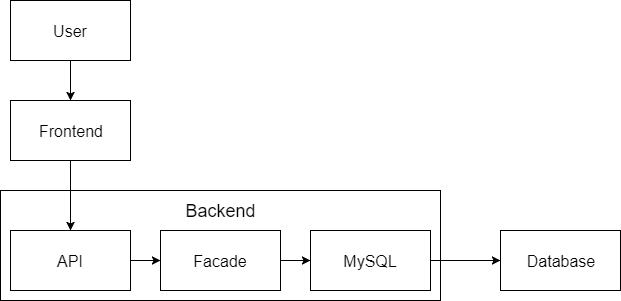

## HackerNews Operation Documentation

### System Overview  

The system contains 2 subsystems and a database.  
The subsystems consist of: A frontend primarily made in Angular, and a backend made in Java.  
For the database we have used a MySQL Database.  
The full documentation and requirements can be found [here](https://github.com/pilgaard/large_systems/blob/master/Documentation.md).

### System Completion Status

Below is a collection of all our User Stories.   
User stories marked with red are not implemented as of the official delivery date.  
User stories marked with orange are partly implemented as of the official delivery date.

| **Id** | **User Story** | **Id** | **User Story** |
| --- | --- | --- | --- |
|   | **Before login** |   |   |
| **1** | A user must be able to read stories in a sorted order | **2** | A user must be able to register a new account |
| **3** | A user must be able to retrieve a new password for his/her account. | **4** | A user must be able to log in to his/her account |
| **5** | A user must be able to view all comments submitted to a story | **6** | A user must be able to see time-since-submit of stories |
| **7** | A user must be able to see the amount of comments made to a story | **8** | A user must be able to see the amount of karma accumulated by a story |
| **9** | A user must be able to hide comment-trees | **10** | A user must be able to un-hide comment-trees  |
|   | **After successful login** |   |   |
| **11** | A user must be able to submit new stories (title/url/text) | **12** | A user must be able to edit his/her submitted stories |
| **13** | A user must be able to view a list of his/her submitted stories | **14** | A user must be able to delete his/her stories |
| **15** | A user must be able to submit a comment to a story (text/gif/link/img) | **16** |A user must be able to submit a comment (text/gif/link/img) to a comment |
| **17** | A user must be able to view a list of his/her submitted comments | **18** | A user must be able to delete his/her comments |
| **19** | A user must be able to edit his/her submitted comments | **20** | A user must be able to edit his/her profile |
| **21** | A user must be able to delete his/her profile | **22** | A user must be able to edit the email assigned to his/her profile |
| **23** | A user must be able to mark stories as  favorites | **24** | A user must be able to mark comments as favorites |
| **25** | A user must be able to view a list of all  his/her favorite entities | **26** | A user must be able to remove entities from his/her list of favorites |
| **27** | A user must be able to switch between sub-pages of different categories. | **28** | A user must be able to flag stories as spam |
| **29** | A user must be able to flag stories as spam | **30** | A user must be able to upvote stories |
| **31** | A user must be able to downvote stories when they have 500+ karma | **32** | Users must be able to downvote comments when they have 500+ karma |
| **33** | A user must be able to upvote comments | **34** |   |
| **35a** | A user must be able to view his/her amount of karma points | **35b** | Karma points must be calculated by (upvotes - downvotes) |
| **36** | A User must be able to log out |   |   |

### System Architecture

[Information regarding machine setup]

### Accessibility

[Information about how to access machines (IPs, username/password etc)]  
Frontend:  
Backend:  

### Dataflow

Below is an image which illustrates the dataflow of the systems. 

### Bug reports and Issues

In case of bugs or errors, submit an issue [here](https://github.com/pilgaard/large_systems/issues).  
Please include any of the following in the description:  
- Actions taken to cause the bug/error.
- Error messages and screen dumps.
- Which user, comment or story was involved in the error, if relevant.

### Inner System information

[How to get information about inner system]
